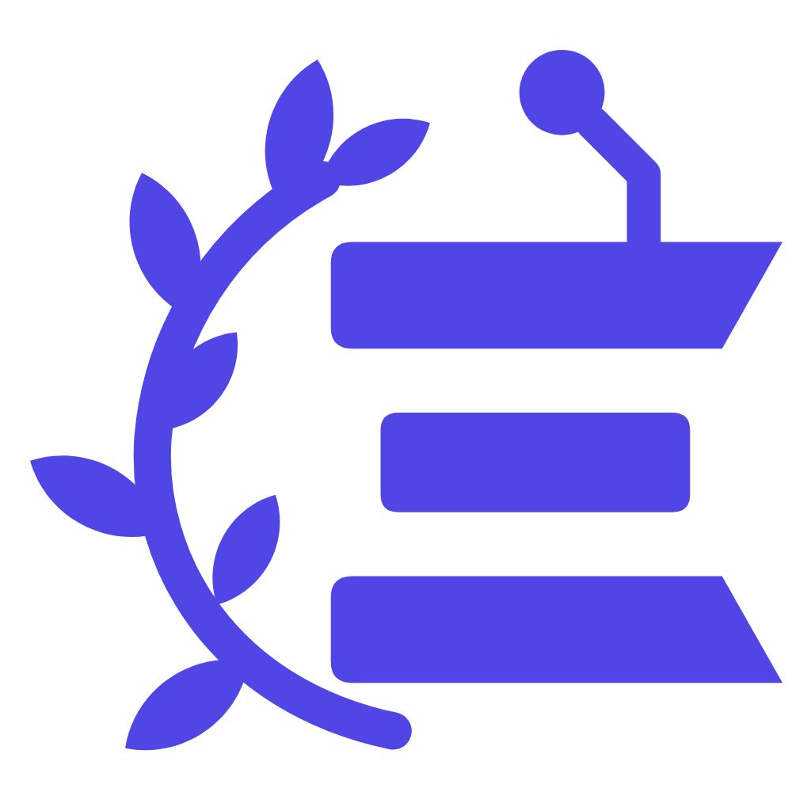
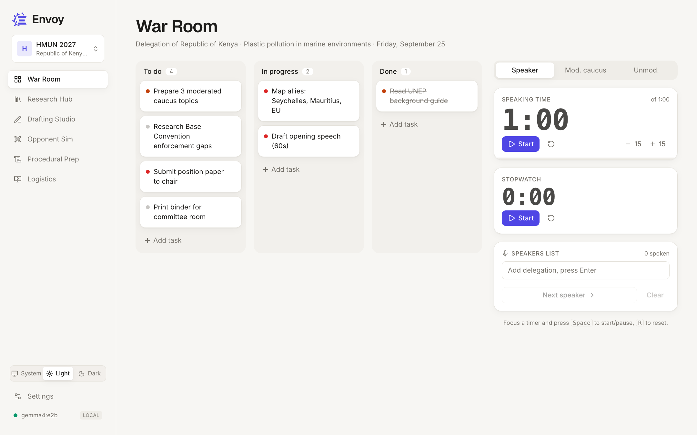
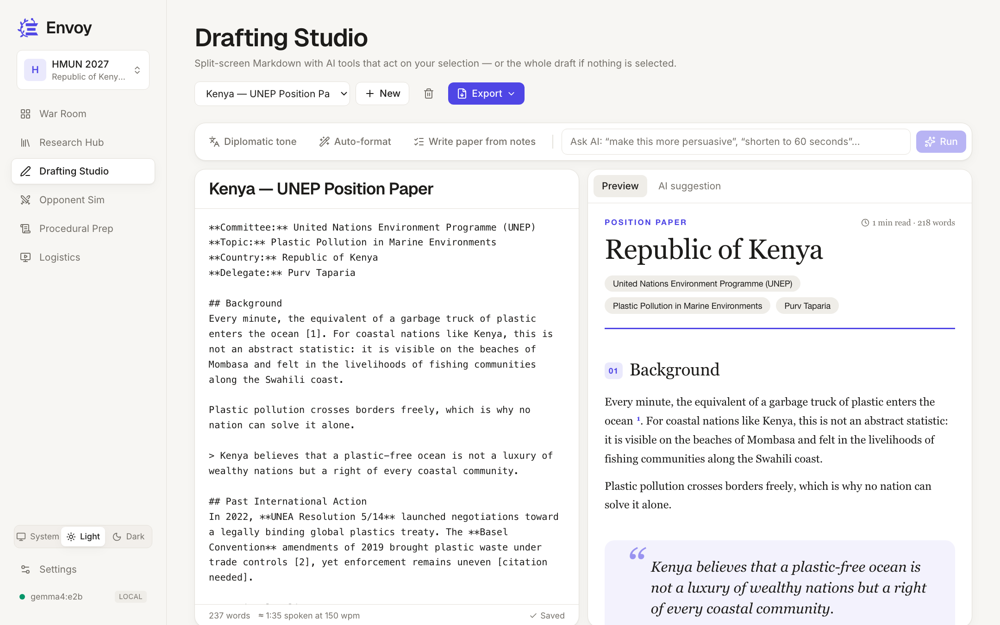
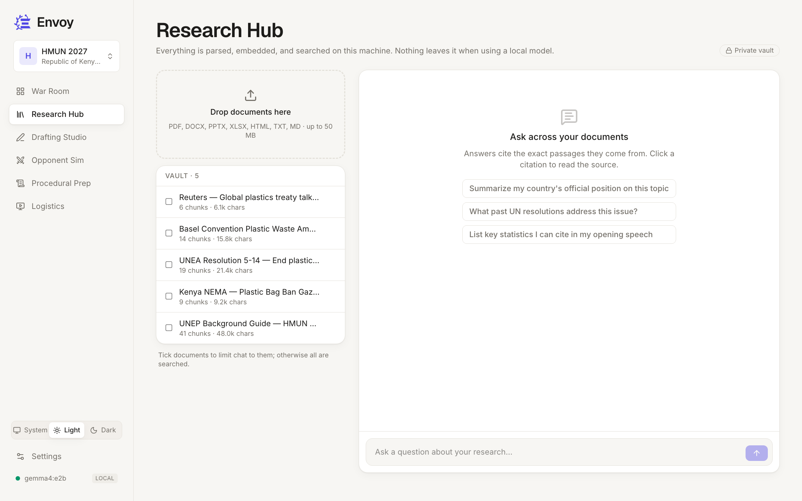
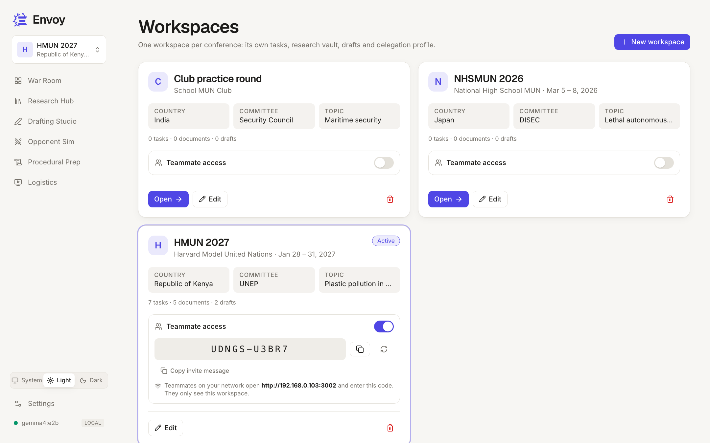
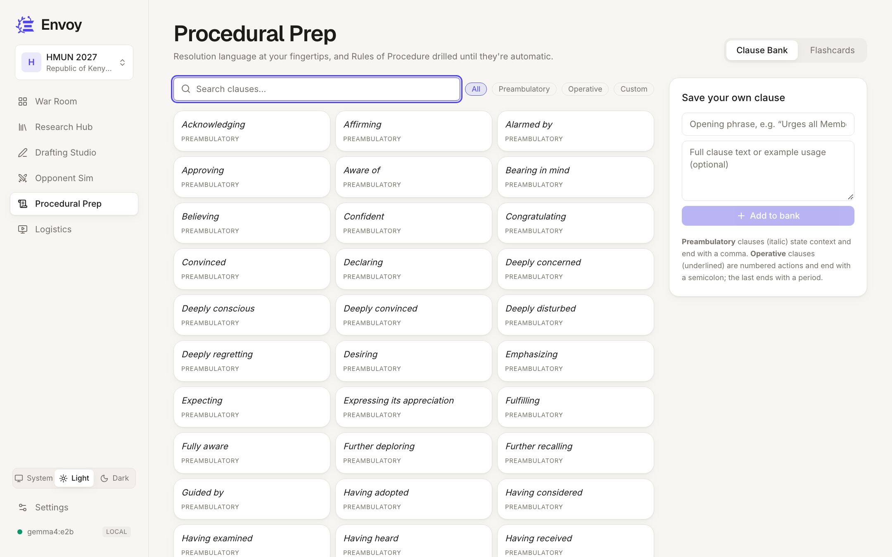
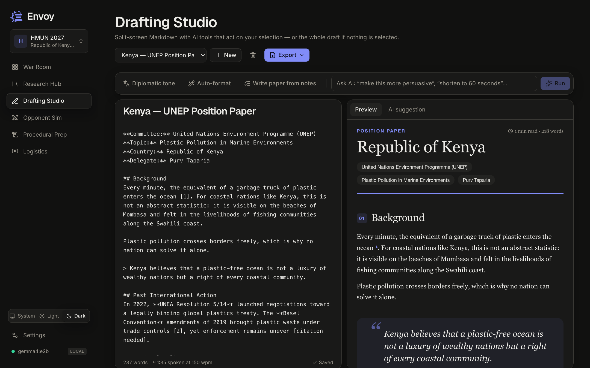

<p align="center"></p>

# Envoy — a private, local AI workspace for Model UN

Envoy is a desktop-grade workspace for Model UN delegates: task board and committee timers, a private research vault you can chat with (with citations), an AI drafting studio, an opponent simulator, procedural flashcards, a paced teleprompter, and a one-file offline binder.

By default **everything runs on your Mac**: documents are parsed, embedded and searched locally, and the AI runs through [Ollama](https://ollama.com). Cloud models (OpenAI, Anthropic, Gemini…) are optional and opt-in from Settings.

| Layer | Tech |
|---|---|
| Frontend | Next.js 16 (App Router) · React 19 · Tailwind CSS 4 |
| Backend | Python · FastAPI · SQLite (stdlib `sqlite3`) |
| AI routing | LiteLLM → Ollama at `localhost:11434` (default) or any cloud provider |
| RAG | Microsoft MarkItDown (parsing) · ChromaDB (local vectors) · `nomic-embed-text` embeddings |
| Export | python-docx (Word position papers) · reportlab (PDF guide) · self-contained HTML binder |

## A look inside

| War Room | Drafting Studio |
|---|---|
|  |  |
| **Research Hub** | **Workspaces & sharing** |
|  |  |
| **Procedural Prep** | **Dark mode** |
|  |  |

**Features**

- **War Room:** drag-and-drop task board, speaker, moderated and unmoderated caucus timers with overtime, a stopwatch and a speakers list.
- **Research Hub:** drop in PDFs, Word, PowerPoint, Excel or web pages. Everything is parsed and embedded locally; chat across your documents with clickable citations.
- **Drafting Studio:** split-screen Markdown editor. AI tools rewrite in a diplomatic tone, auto-format position papers, or write one from notes. Export to **PDF** or **Word** in the same style as the preview.
- **Opponent Simulator:** the five strongest counter-arguments a chosen delegation would make, then factual rebuttals pulled from your own documents.
- **Procedural Prep:** searchable clause bank and Rules of Procedure flashcards.
- **Logistics:** teleprompter paced at 150 words per minute (adjustable) and a one-file offline binder of your whole workspace.
- **Workspaces:** one per conference, each with its own delegation profile. Share one with teammates on your network using an access code.
- **Settings:** five themes, seven accent colours, timer defaults, local or cloud AI models, and research-search tuning.

---

## Quick start

```bash
npm run dev
```

That's it. Run it from the project root. The first run:

1. creates a Python virtualenv in `backend/.venv` and installs the backend dependencies (a few minutes),
2. installs the frontend dependencies into `frontend/node_modules`,
3. starts Ollama if it's installed but not running, and pulls the `nomic-embed-text` embedding model if it's missing,
4. starts the API on **http://127.0.0.1:8000** and the app on **http://localhost:3000**, then opens your browser.

Later runs skip straight to step 4. `Ctrl+C` stops everything. Set `ENVOY_NO_OPEN=1` to skip opening the browser, or `ENVOY_NO_PULL=1` to skip the automatic embedding-model download.

---

## Installation from scratch (macOS, Apple Silicon)

### 1. Homebrew

```bash
/bin/bash -c "$(curl -fsSL https://raw.githubusercontent.com/Homebrew/install/HEAD/install.sh)"
```

### 2. Node.js (≥ 20.11) and Python (3.12 recommended)

```bash
brew install node python@3.12
```

> **Why Python 3.12?** ChromaDB depends on `onnxruntime`, whose wheels often lag the newest Python release. The launcher automatically prefers `python3.12`, then `3.13`, `3.11`, and finally `python3`. If `pip install` fails on a very new Python, install 3.12 and delete `backend/.venv`.

### 3. Ollama (local AI)

```bash
brew install ollama          # or download the app from https://ollama.com/download
ollama serve                 # leave running (the macOS app does this automatically)
```

Pull a chat model and the embedding model:

```bash
ollama pull llama3.2         # 3B, fast on any Apple Silicon Mac (~2 GB)
ollama pull nomic-embed-text # embeddings for the Research Hub (~270 MB)
```

Model suggestions by RAM:

| Mac RAM | Chat model | Notes |
|---|---|---|
| 8 GB | `llama3.2` (3B), `qwen2.5:3b`, `gemma3:4b` | Snappy, good for drafting and short answers |
| 16 GB | `qwen2.5:7b`, `llama3.1:8b`, `gemma3:12b` | Noticeably better reasoning and citations |
| 32 GB+ | `qwen2.5:14b`, `gemma3:27b`, `mistral-small` | Best quality for position papers |

On first launch Envoy picks an installed chat model automatically if you haven't chosen one. Change it any time in **Settings → AI Engine** (installed models show up as one-click chips).

### 4. Run

```bash
cd Envoy
npm run dev
```

---

## Manual setup (optional)

If you prefer running each piece yourself:

```bash
# Backend
cd backend
python3.12 -m venv .venv
.venv/bin/pip install -r requirements.txt
.venv/bin/python -m uvicorn app.main:app --host 127.0.0.1 --port 8000 --reload

# Frontend (second terminal)
cd frontend
npm install
npm run dev
```

The frontend talks to `http://127.0.0.1:8000` by default. To change it, copy `frontend/.env.local.example` to `frontend/.env.local` and edit `NEXT_PUBLIC_API`. If you move the frontend off port 3000, add its origin to the `ENVOY_ORIGINS` env var for the backend (comma-separated).

---

## Using cloud models (optional)

Go to **Settings → AI Engine**, pick a provider, and paste an API key. Model strings follow [LiteLLM's format](https://docs.litellm.ai/docs/providers), for example:

- `anthropic/claude-sonnet-5`
- `openai/gpt-4.1-mini`
- `gemini/gemini-2.5-flash`
- `openai/<model>` with a custom API base for LM Studio, vLLM, or any OpenAI-compatible server

The key is stored only in your local SQLite database and is never sent back to the browser in full. **Note:** with a cloud provider, the text you send (including retrieved document passages) goes to that provider. Embeddings stay on Ollama unless you change the embedding model too.

---

## Project layout

```
Envoy/
├── package.json            # `npm run dev` → scripts/dev.mjs
├── scripts/dev.mjs         # bootstrap + run backend and frontend together
├── backend/
│   ├── requirements.txt
│   ├── app/
│   │   ├── main.py         # FastAPI routes
│   │   ├── db.py           # SQLite schema, seeds (clauses, RoP cards), settings
│   │   ├── llm.py          # LiteLLM routing, prompts, streaming, embeddings
│   │   ├── rag.py          # MarkItDown parsing, chunking, ChromaDB search
│   │   ├── export.py       # Offline Binder HTML
│   │   └── docx_export.py  # Position paper → styled, editable Word document
│   └── tests/test_core.py
├── frontend/
│   ├── app/                # one folder per feature page + settings
│   ├── components/         # Sidebar, Kanban, Timer, shared UI
│   └── lib/                # API client + streaming hook, settings provider
├── docs/
│   ├── brand/              # logo SVG sources, transparent PNG exports, render.sh
│   ├── USER_GUIDE.md
│   └── build_guide_pdf.py  # USER_GUIDE.md → styled PDF (reportlab)
└── data/                   # created at runtime: envoy.db + chroma/ (git-ignored)
```

## Workspaces & sharing

Create one workspace per conference (sidebar → workspace switcher → **New workspace**). Each has its own tasks, research vault, drafts and delegation profile; app settings, the clause bank and flashcards are shared.

To collaborate, open **Manage & share**, switch on **Teammate access** for a workspace and send the access code. Start Envoy with `npm run share`; teammates on the same network open the printed URL (e.g. `http://192.168.0.12:3001`) and enter the code. They can only see and edit that workspace, can't change your AI settings, and never see your API key. Turning sharing off, or generating a new code, locks them out immediately.

## Data & privacy

- All data lives in `data/` — `envoy.db` (tasks, drafts, documents as Markdown, clauses, cards, settings) and `chroma/` (vectors). Back up or move your workspace by copying that folder.
- With `npm run dev` the API binds to `127.0.0.1` only. `npm run share` opens it to your local network, and every request from another device needs a valid workspace access code.
- ChromaDB and LiteLLM telemetry are disabled.
- Fonts are self-hosted at build time; the app makes no third-party requests at runtime.

## Handy commands

| Command | What it does |
|---|---|
| `npm run dev` | Bootstrap (first run) and start everything (this Mac only) |
| `npm run share` | Same, but reachable on your Wi-Fi so teammates can join a workspace with its access code |
| `npm test` | Backend self-checks + frontend type-check |
| `npm run guide:pdf` | Build `docs/Envoy_User_Guide.pdf` from the user guide |
| `bash docs/brand/render.sh` | Re-export the logo PNGs (transparent) from the SVG sources |

## Troubleshooting

| Symptom | Fix |
|---|---|
| "Can't reach Ollama" | Open the Ollama app or run `ollama serve`. |
| "Model not installed" | `ollama pull <model>` or pick an installed one in Settings. |
| Upload fails with an embedding error | `ollama pull nomic-embed-text` (or set another embedding model in Settings → Research & RAG, then **Re-index**). |
| "No extractable text" on a PDF | It's a scanned image. Run it through OCR first (macOS Preview → Export as PDF with text, or `ocrmypdf`). |
| `pip install` fails building `onnxruntime`/`chromadb` | Use Python 3.12: `brew install python@3.12 && rm -rf backend/.venv && npm run dev`. |
| Port already in use | `npm run dev` automatically moves to the next free port and prints the URL. |

See **[docs/USER_GUIDE.md](docs/USER_GUIDE.md)** for a walkthrough of every feature.

## License

[MIT](LICENSE) © 2026 Purv Taparia
