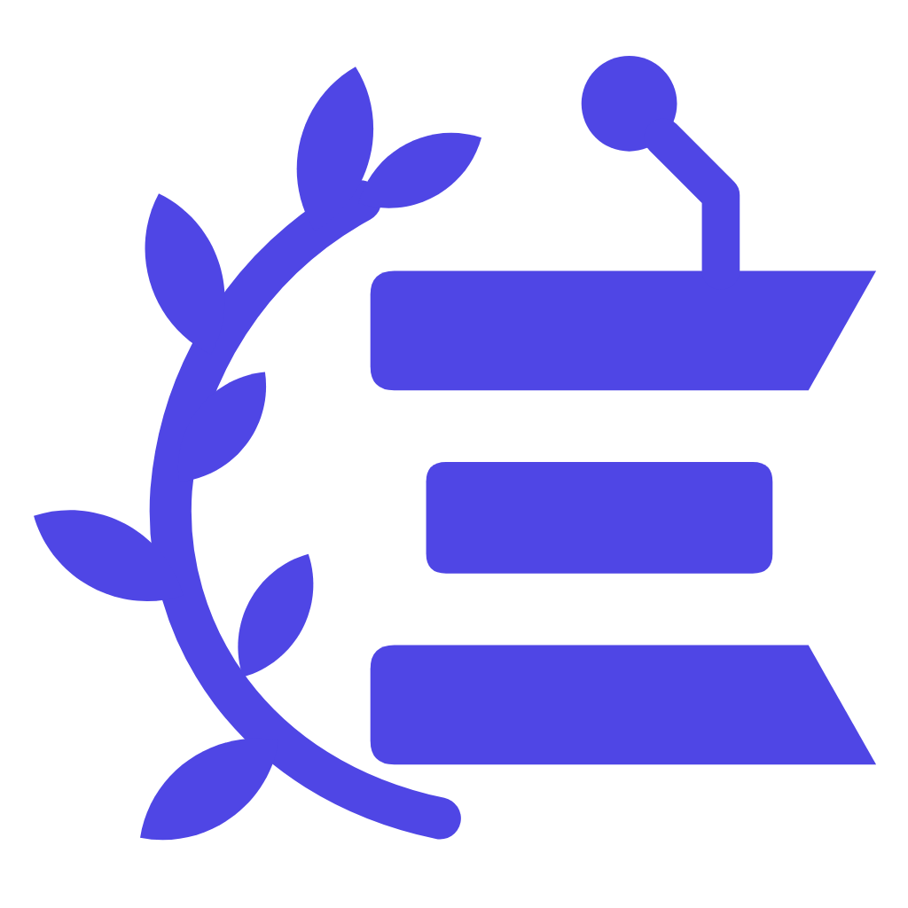
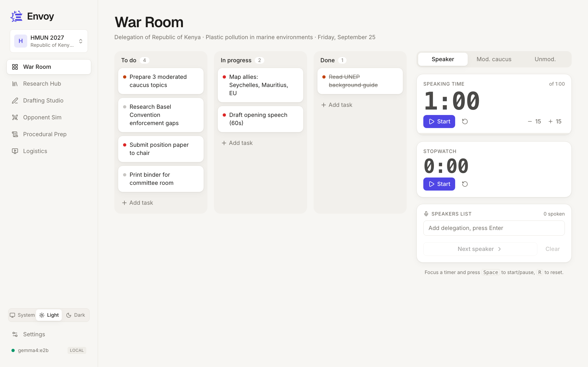
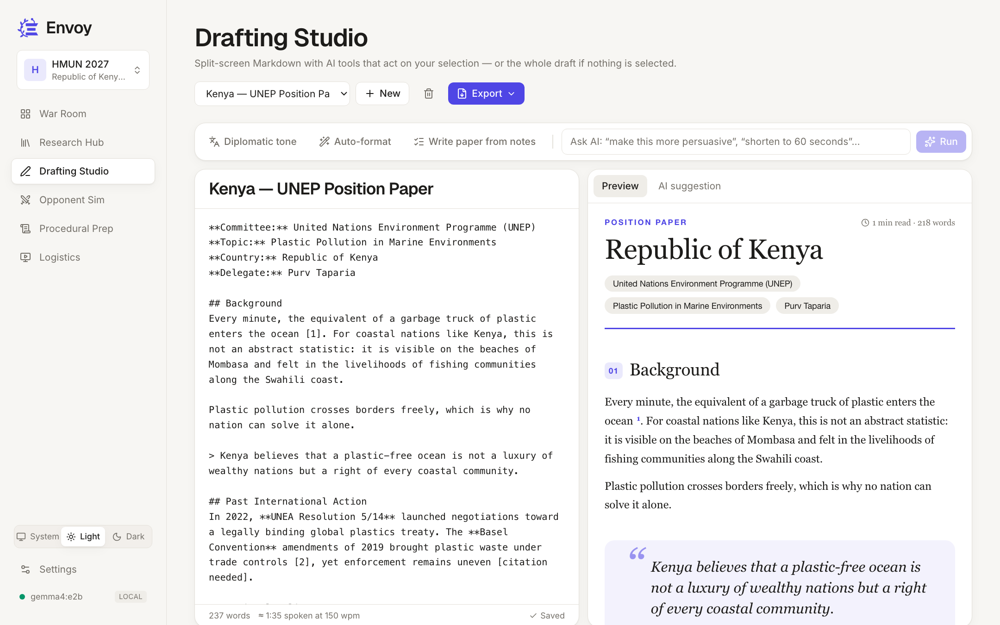
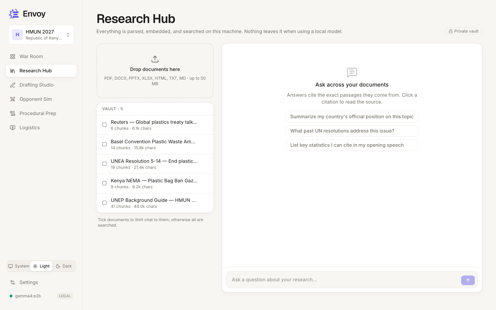
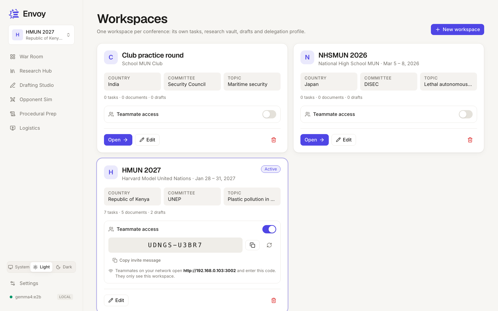
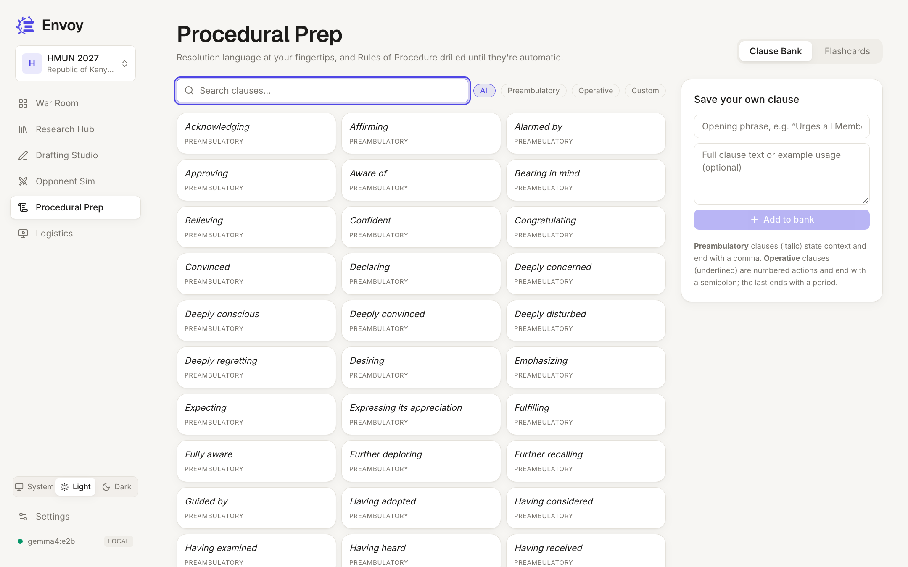
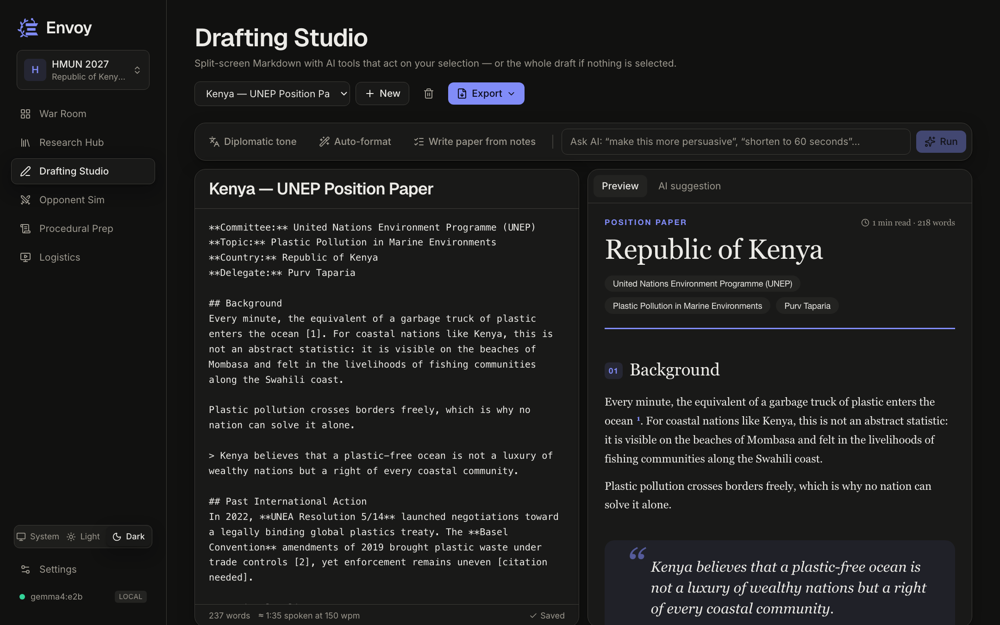

<p align="center"></p>

# Envoy — a free AI workspace for Model UN and debate

Envoy is a web app for Model UN delegates and debaters. It has a task board and committee timers, a research vault you can chat with (answers cite their sources), cited web research briefs, an AI drafting studio with Word export, an opponent simulator, debate prep (flow, sparring, timers), procedure flashcards, a paced teleprompter, and a one-file offline binder.

Sign in with Google and you're ready. Each conference or tournament gets its own workspace, which you can share with your team using an access code or an emailed invite link. AI runs on **your own API key** (Google Gemini and Groq have free tiers). Envoy can also use a model **running on your own computer** through [Ollama](https://ollama.com): the browser calls `localhost:11434` directly, so this works even on the hosted site.

| Layer | Tech | Cost |
|---|---|---|
| Frontend | Next.js 16 (App Router) · React 19 · Tailwind CSS 4, on **Vercel** | Free (Hobby) |
| Auth & data | **Firebase** Authentication (Google) · Cloud Firestore with offline cache | Free (Spark) |
| Sharing | Firestore membership + access codes, enforced by `firestore.rules` | Free |
| Invite emails | **Google Apps Script** web app (`apps-script/Code.gs`) sending from your Gmail | Free (~100/day) |
| AI | Your key → Gemini / Groq / OpenRouter / OpenAI / Anthropic via a Vercel relay, or Ollama / LM Studio straight from the browser | Free tiers available |
| Research | In-browser parsing (pdf.js, mammoth) and BM25 retrieval · web search (DuckDuckGo, Brave or Serper) in a Vercel function | Free |
| Export | `docx` (Word, styled like the preview) · browser print → PDF · self-contained HTML binder | — |

## A look inside

| War Room | Drafting Studio |
|---|---|
|  |  |
| **Research Hub** | **Workspaces & sharing** |
|  |  |
| **Procedural Prep** | **Dark mode** |
|  |  |

**Features**

- **War Room:** drag-and-drop task board, speaker, moderated and unmoderated caucus timers with overtime, a stopwatch and a speakers list.
- **Research Hub:** drop in PDFs, Word, PowerPoint, Excel or web pages. Everything is parsed and embedded locally; chat across your documents with clickable citations.
- **Drafting Studio:** split-screen Markdown editor. AI tools rewrite in a diplomatic tone, auto-format position papers, or write one from notes. Export to **PDF** or **Word** in the same style as the preview.
- **Opponent Simulator:** the five strongest counter-arguments a chosen delegation would make, then factual rebuttals pulled from your own documents.
- **Procedural Prep:** searchable clause bank and Rules of Procedure flashcards.
- **Logistics:** teleprompter paced at 150 words per minute (adjustable) and a one-file offline binder of your whole workspace.
- **Workspaces:** one per conference, each with its own delegation profile. Share one with teammates on your network using an access code.
- **Settings:** five themes, seven accent colours, timer defaults, local or cloud AI models, and research-search tuning.

---

## Quick start (local development)

```bash
git clone https://github.com/tapariapurv/envoy.git && cd envoy
cp frontend/.env.local.example frontend/.env.local   # fill in your Firebase web config
npm run dev                                          # http://localhost:3000
```

`npm test` runs the type check and the retrieval self-checks. `npm run build` makes a production build.

## Deploy your own (all free)

1. **Firebase.** Go to [console.firebase.google.com](https://console.firebase.google.com) and create a project (you can turn off Analytics). Then:
   - Under **Authentication → Sign-in method**, enable **Google**.
   - Under **Firestore → Create database**, pick Standard edition in production mode.
   - Under **Firestore → Rules**, paste [`firestore.rules`](firestore.rules) and publish.
   - Under **Project settings → Your apps**, add a Web app and copy its config into `frontend/.env.local`.
2. **Vercel.** Import the GitHub repo at [vercel.com/new](https://vercel.com/new) and set **Root Directory** to `frontend`. Add the four `NEXT_PUBLIC_FIREBASE_*` variables, then deploy.
3. **Authorize the domain.** In Firebase, go to **Authentication → Settings → Authorized domains** and add your `*.vercel.app` domain. Google sign-in won't work there until you do.
4. **Optional: invite emails.** At [script.google.com](https://script.google.com), create a new project and paste [`apps-script/Code.gs`](apps-script/Code.gs).
   - Set the script properties `FIREBASE_API_KEY`, `FIREBASE_PROJECT` and `APP_ORIGIN` (your site URL).
   - Deploy it as a **Web app**, executing as *Me*, with access for *Anyone*.
   - Put the `/exec` URL in `NEXT_PUBLIC_MAIL_URL` on Vercel and redeploy.

Free tier headroom: Firestore allows 50k reads and 20k writes per day plus 1 GiB of storage. Vercel Hobby includes 100 GB of bandwidth.

## AI engine

Pick a provider in **Settings → AI Engine** and paste your key. It is saved privately to your account and teammates never see it.

| Provider | Free? | Example model |
|---|---|---|
| Google Gemini | Free tier ([key](https://aistudio.google.com/apikey)) | `gemini/gemini-2.5-flash` |
| Groq | Free tier ([key](https://console.groq.com/keys)) | `groq/llama-3.3-70b-versatile` |
| OpenRouter | Free models | `openrouter/meta-llama/llama-3.3-70b-instruct:free` |
| OpenAI / Anthropic | Paid | `openai/gpt-4.1-mini`, `anthropic/claude-sonnet-5` |
| **Ollama on your computer** | Free, private | `ollama/llama3.2` |

**Using a local model from the hosted site.** Install Ollama and run `ollama pull llama3.2`. Then quit the Ollama app and start it with your site allowed:

```bash
OLLAMA_ORIGINS="https://your-envoy.vercel.app" ollama serve
```

Chrome treats `http://localhost` as secure, so the hosted page can call it, and your text never leaves your machine. LM Studio works the same way under "OpenAI-compatible".

## Project layout

```
firestore.rules          who can read/write what (workspace members, personal data, access codes)
apps-script/Code.gs      invite mailer (Google Apps Script web app)
frontend/
  app/                   pages (War Room, Research Hub, Drafting, Debate…)
  app/api/llm/route.ts   relays chat completions to cloud providers with the user's key
  app/api/web/route.ts   web research: search → read trusted pages → rank passages
  lib/backend.ts         the app's REST paths served from Firestore in the browser
  lib/ai.ts              prompts, retrieval, streaming, web research (plan + write)
  lib/exporters.ts       file parsing, Word export, offline binder
  lib/firebase.ts        Firebase init (Google sign-in, Firestore offline cache)
  tests/core.test.mts    retrieval self-checks
```

## Workspaces & sharing

Each workspace holds its own tasks, research documents, drafts, debate rounds and flows. The delegation profile (country, committee, topic, or for debate the format, side and motion) belongs to the workspace too. Settings, the clause bank, flashcards and the motion bank belong to you.

To share a workspace, open **Workspaces** and turn on **Teammate access**. Then send the invite link (`/?join=CODE`), email it, or share the code for teammates to enter on their own Workspaces page. Joined members can edit the workspace's content and profile. Only the owner can rename, share or delete it. To cut access for future joiners, make a new code.

## Data & privacy

- Your data lives in your Firebase project under your Google account. It is also cached in the browser, so pages open instantly and edits made offline sync later.
- Uploaded files are parsed **in your browser**, and only the extracted text is stored.
- Text goes to an AI provider only when you run an AI tool, and only to the provider you chose. With Ollama, nothing leaves your computer.

## Troubleshooting

| Problem | Fix |
|---|---|
| Google sign-in fails on your domain | Add the domain under Firebase → Authentication → Settings → Authorized domains. |
| "Can't reach the AI engine" with Ollama | Start Ollama with `OLLAMA_ORIGINS` set to your site (see above). |
| "Add your API key" | Settings → AI Engine. Gemini and Groq keys are free. |
| Web research: "DuckDuckGo returned 202" | DuckDuckGo throttles shared servers. Try again, or add a free Brave or Serper key in Settings → Web Research. |
| Scanned PDF has no text | Run OCR first. Envoy reads the PDF's text layer. |

## License

[MIT](LICENSE) © 2026 Purv Taparia
