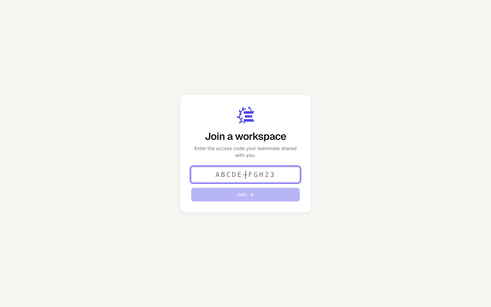
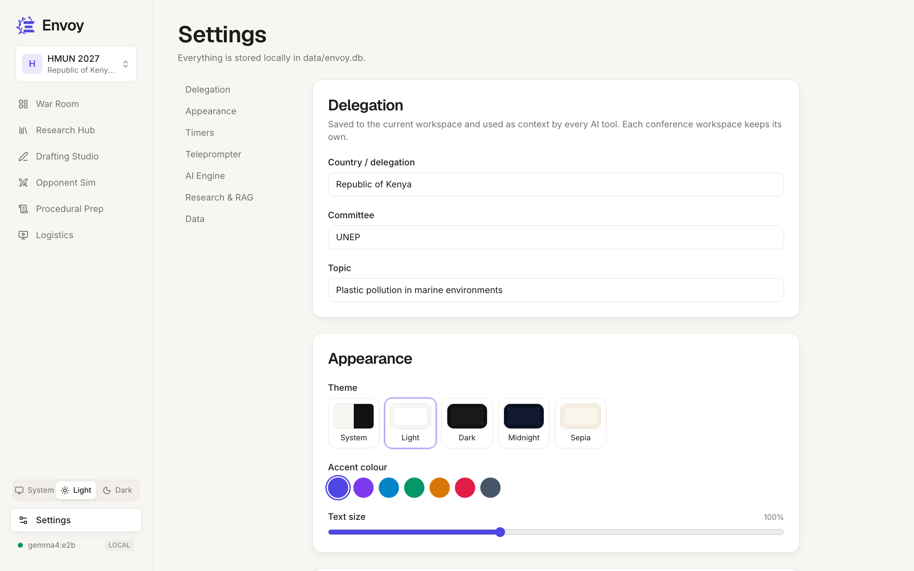

# Envoy User Guide

Envoy is your private Model UN workspace. This guide walks through every feature in the order you'd typically use them while preparing for, and competing at, a conference.

## Getting Started

1. From the project folder, run `npm run dev`. Envoy opens at **http://localhost:3000**.
2. Open **Settings** (bottom of the sidebar) and fill in **Delegation**: your country, committee and topic. Every AI tool uses these, so its answers are written from your delegation's point of view.
3. Check the status light at the bottom of the sidebar. **Green** means the AI engine is reachable. The label shows the active model and whether it's **Local** or **Cloud**.

> **Tip:** Every change in Settings saves automatically. Look for "All changes saved" at the top of the page.

**Light, Dark or System?** Use the switcher at the bottom of the sidebar (on a phone, it's the sun/moon button in the top bar). **System** follows your Mac's appearance automatically. Settings → Appearance offers two more themes, Midnight and Sepia, plus seven accent colours.

## Workspaces

Create a workspace for each conference you attend, like *HMUN 2027* or *NHSMUN 2026*. Each one has its own tasks, research documents, drafts and delegation (country, committee, topic). Switching workspaces changes all of these at once.

- **Switch:** click the workspace name at the top of the sidebar and pick another.
- **Create:** choose **New workspace** in that menu, then fill in the name, conference, dates, country, committee and topic.
- **Manage:** **Manage & share** shows every workspace with its counts. From there you can open, edit or delete one.

App settings (theme, AI engine, timers), the clause bank and the flashcards are shared by all workspaces.

### Sharing a workspace with teammates

1. In **Manage & share**, turn on **Teammate access** for a workspace. You'll get a code such as `DHKT4-BD3VW`.
2. Quit Envoy and start it with `npm run share`. The terminal prints a network address, for example `http://192.168.0.12:3001`.
3. Send your teammate the address and the code. **Copy invite message** does both at once.
4. Your teammate opens the address on the same Wi-Fi and enters the code.

Guests can use everything inside that one workspace, including the AI tools, which run on your Mac. They can't see your other workspaces, change your app settings, or see your API key. Turn the switch off, or press ↻ for a new code, to revoke access immediately.

## War Room Dashboard

The War Room is your home base during committee sessions.

### Task board (Kanban)

- **Add a task:** type in the "Add task" row at the bottom of any column and press Enter.
- **Move a task:** drag it to another column, or drop it on top of another card to put it right before that card.
- **Rename:** click the text of a task, edit it, and press Enter.
- **Priority:** click the coloured dot to cycle through low (grey), medium (amber) and high (red).
- **Delete:** hover over a task and click the trash icon.

Suggested columns for a conference: research to-dos in **To do**, the resolution you're co-writing in **In progress**, and finished speeches in **Done**.

### Procedure timers

The tabs switch between **Speaker**, **Moderated caucus** (total time plus per-speaker time), and **Unmoderated caucus**. A **Stopwatch** is always visible. The default durations come from Settings → Timers.

- **Start / Pause:** the main button, or focus the timer and press **Space**. Press **R** to reset.
- **Adjust on the fly:** use **−15 / +15** while a timer is running.
- **Set a custom duration:** when a timer is paused, click the large time, type `m:ss` (for example `1:30`), and press Enter.
- **Warnings:** the timer turns amber when it gets close to zero and red when time is up. It then keeps counting overtime (shown as `+0:07`) so you can see how far a speaker ran over. A chime plays at zero if sound is on.
- Timers keep running when you switch tabs.

### Speakers list

Type a delegation's name and press Enter to add it to the queue. The highlighted row is the current speaker. **Next speaker** moves the queue along and counts how many have spoken. The list is saved in your browser.

## Research Hub

A private document vault you can chat with. Answers come with citations.

### Adding documents

Drag files onto the drop zone, or click it to browse. Supported formats: **PDF, DOCX, PPTX, XLSX, HTML, TXT, Markdown, CSV and JSON**, up to 50 MB each.

Each file is:
1. converted to Markdown with Microsoft MarkItDown,
2. split into overlapping chunks (you can change the size in Settings),
3. embedded locally and stored in ChromaDB, with the full text kept in SQLite.

> **Scanned PDFs** contain images instead of text, so Envoy will report "No extractable text". Run OCR on them first.

Good documents to add: your committee's background guide, your country's UN statements and voting record, past resolutions, NGO or think-tank reports, and recent news.

### Chatting with your documents

Type a question and press Enter (Shift+Enter adds a new line). By default Envoy searches the whole vault. To limit a question to certain documents, **tick the checkboxes** next to them.

- Each answer cites its sources inline, like **[1]** or **[2]**. **Click a citation** to open the exact passage it came from.
- The source chips under an answer list every passage used. Hover over one to see its relevance score.
- Click a document's name in the vault to read its full parsed text.
- Follow-up questions keep the recent conversation as context. **New conversation** starts fresh.

If the documents don't contain the answer, Envoy says so rather than making something up.

## Drafting Studio

A split-screen Markdown editor with AI tools built in.

- **Left:** the editor. The title at the top and the content both **autosave**; press **⌘S** to save immediately. The footer shows the word count and how long the text takes to read aloud at your teleprompter pace.
- **Right:** a **Preview** tab showing the formatted document, and an **AI suggestion** tab.
- Use the menu at the top to switch drafts. Use **New** to start one and the trash icon to delete one.

### AI tools

Every tool works on your **selected text**. If nothing is selected, it works on the **whole draft**.

| Tool | What it does |
|---|---|
| **Diplomatic tone** | Rewrites blunt or casual language into a formal, measured committee register while keeping every point. |
| **Auto-format** | The AI reorganises your draft into the standard position-paper layout *without rewriting it*: a header block, Background, a highlighted key-message quote, Past International Action, National Policy, numbered Proposed Solutions, and a Conclusion. |
| **Write paper from notes** | Turns rough bullet points into a complete, persuasive position paper in the same layout. Unsupported statistics are marked *citation needed*. |
| **Ask AI** | Any instruction, for example "make this more persuasive", "cut to 60 seconds", "add a call to action", or "turn into three operative clauses". |

The suggestion streams into the AI tab. When it's done you can choose:
- **Replace selection / Replace draft**, which swaps it in,
- **Insert below**, which adds it after your selection (or at the end),
- **Copy**, or **Discard** (✕).

### The paper preview

The **Preview** tab typesets your draft like a printed brief:

- a **letterhead** with your country, and chips for committee, topic and delegate,
- **numbered sections**,
- the key message as a large **pull-quote**,
- each proposed solution as a **numbered card**,
- key terms highlighted, `[n]` citations as superscripts, and *citation needed* flags in amber so you can see what still needs a source,
- the reading time and speaking time.

The letterhead comes from lines at the top of the draft such as `**Committee:** UNEP`, `**Topic:** …`, `**Country:** …` and `**Delegate:** …`. Missing fields are filled in from your Settings profile. Auto-format adds these lines for you.

### Exporting to Word

Click **Export** (top right) and choose a format:

| Format | Result |
|---|---|
| **PDF** | Identical to the preview. It's printed from the same page by Chrome, Edge or Brave on your Mac. If none is installed, your browser's print dialog opens so you can choose **Save as PDF**. |
| **Word document** | An editable `.docx` styled like the preview: the letterhead, numbered section badges, shaded key-message quote, numbered proposal cards and highlighted key terms. |
| **Word · conference format** | Times New Roman 12, justified and plain, for conferences that require it. |

**AI-polish layout first** is on by default. The AI tidies the structure before exporting, and the polished version also appears in the AI tab so you can keep it in your draft. Turn it off to export the draft exactly as written.

The `.docx` is fully editable. It uses real Word styles (Title, Heading 1, Quote, numbered lists), so the navigation pane, restyling and track changes all work. It also has a running header with your country and committee, and live page numbers.

## Opponent Simulator & Rebuttal Engine

### Simulate an opponent

1. Enter the **Target delegation** (for example "People's Republic of China") and the **Topic** (filled in from Settings).
2. Write **Your position**, or use **Load from draft…** to pull in a position paper.
3. Click **Generate counter-arguments**.

You get the five strongest arguments that delegation would raise. For each one Envoy shows the argument as they'd say it on the floor, the **underlying national interest** behind it, the **pressure point** where your position is weakest, and a **suggested response**.

### Rebut with evidence

Paste a claim you heard in committee into **Opponent's argument**, or click **Rebut these →** to send the simulated arguments over. **Scan vault for rebuttals** then searches your Research Hub documents and writes a factual rebuttal for each claim, with clickable citations. If your vault has nothing relevant for a claim, it tells you to research further.

> The rebuttal engine only uses your own documents, so the more you upload, the stronger it gets.

## Procedural Prep

### Clause Bank

The bank comes with the standard **preambulatory** (shown in italics) and **operative** (underlined) phrases used in UN resolutions.

- **Search** instantly, and filter with the chips.
- **Click any clause to copy it** so you can paste it into a working paper.
- **Save your own** in the side panel: a phrase plus the full clause or an example. Custom clauses can be deleted. The built-in ones can't.

### Rules of Procedure flashcards

The deck covers points, motions, yields, amendments, voting and majorities.

- **Click the card or press Space** to flip it. Use **← / →** to move between cards.
- **Got it** marks a card as mastered. **Review again** un-marks it. The progress bar tracks how many you've mastered.
- **Unmastered only** drills just the cards you haven't mastered yet. **Shuffle** randomises the order.
- Add your own cards for conference-specific rules in the side panel.

## Logistics

### Paced Teleprompter

Rehearse at real conference pace. The default is **150 words per minute**, a clear and confident speaking rate.

1. **Load a draft**, or click **Edit text** and paste a speech. Click **Done** when you're finished.
2. Press **Start** (or Space). The current word is highlighted and scrolls into the reading band, words you've already said fade, and the bar at the bottom shows your progress and the time left.
3. Adjust the pace with the slider or **↑ / ↓** (5 wpm per press). The change takes effect straight away. The label tells you whether you're at a *Measured*, *Conversational* or *Brisk* pace.
4. **Click any word** to jump there. Press **R** to reset.
5. Use **Aa** to change the text size, **Mirror** to flip the text for beam-splitter teleprompter glass, and the **fullscreen** button to present.

Markdown symbols and citation markers are removed automatically, so you only see the words you'll speak.

### Offline Binder

**Export binder** downloads a single `.html` file containing all of your tasks, drafts, every research document, the clause bank, and the procedure cards. It:

- works with **no internet and no Envoy running**, so you can open it on any laptop, tablet or phone,
- has a **search box** that filters the whole binder as you type,
- follows your device's light or dark mode, and prints cleanly.

Export a fresh binder the night before the conference.

## Settings

Everything is saved automatically to your local database.

| Section | Options |
|---|---|
| **Delegation** | Country, committee, topic. These give every AI tool context. |
| **Appearance** | Theme (System, Light, Dark, Midnight, Sepia), accent colour (7 options), text size. The sidebar switcher changes System/Light/Dark from any page. |
| **Timers** | Default speaking time, moderated caucus total and per-speaker time, unmoderated caucus, warning threshold, chime on/off. |
| **Teleprompter** | Default words per minute, font size, mirror by default. |
| **AI Engine** | Provider (Ollama, OpenAI, Anthropic, Gemini, OpenAI-compatible), model, API base URL, API key, creativity (temperature), max response length, and **Test connection**. Installed Ollama models appear as one-click chips. |
| **Research & RAG** | Embedding model, chunk size, chunk overlap, passages per answer, and **Re-index all documents**. |
| **Data** | Export the binder, or reset settings to their defaults (your content is kept). |

### Choosing RAG parameters

- **Chunk size:** smaller chunks (600–900 characters) give more precise citations. Larger chunks (1500–2500) give each passage more context. The default of 1200 works well for UN documents.
- **Overlap:** keeps sentences that fall on a chunk boundary from being lost. About 15% of the chunk size is a good rule of thumb.
- **Passages per answer:** more passages give broader answers but make them slower on small local models. Use 4–8.
- After changing any of these, or the embedding model, click **Re-index all documents**.

### Local vs. cloud

With **Ollama**, nothing leaves your Mac. With a cloud provider, the text of each request (including the document passages it retrieves) is sent to that provider. Your API key is stored locally and only ever shown masked (`••••1234`).

## Keyboard Shortcuts

| Where | Keys | Action |
|---|---|---|
| Timers | Space / R | Start or pause / reset the focused timer |
| Research chat | Enter / Shift+Enter | Send / new line |
| Drafting | ⌘S / Esc | Save now / close the Export menu |
| Flashcards | Space, ← / → | Flip, previous / next |
| Teleprompter | Space, ↑ / ↓, R | Start or pause, speed ±5 wpm, reset |

## Troubleshooting

- **Red status light, "Ollama not running":** open the Ollama app or run `ollama serve`.
- **"Model not installed":** run `ollama pull llama3.2`, or choose an installed model in Settings.
- **Uploads fail with an embedding error:** run `ollama pull nomic-embed-text`.
- **Slow answers:** use a smaller model, lower "Passages per answer", or lower "Max response length".
- **"Backend offline":** make sure `npm run dev` is still running in your terminal.
